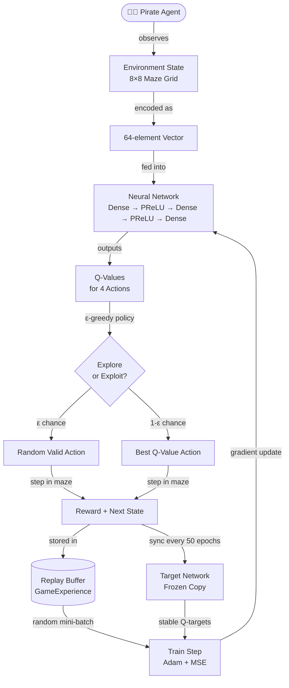
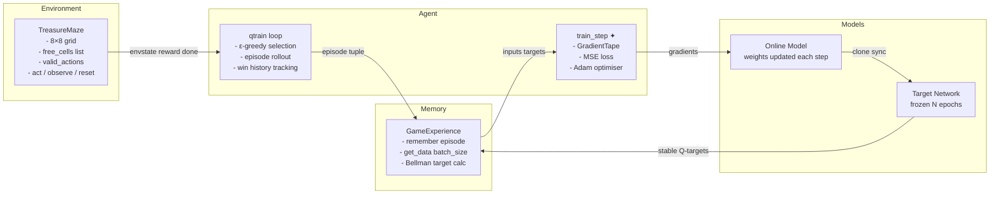
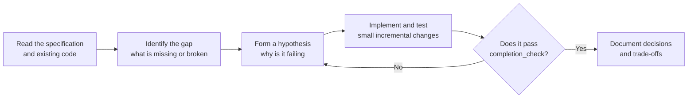

# CS-370 Project Two: Pirate Intelligent Agent
### Deep Q-Learning Treasure Hunt — Portfolio Submission

---

## Project Overview

---

## What Code Was Given vs. What I Created

### Provided by the Course

The starter package included:
- **`TreasureMaze.py`** — the environment class managing maze state, valid actions, rewards (`+1` win, `-0.04` step penalty, `-1` blocked), and game-over detection.
- **`GameExperience.py`** — the replay buffer class storing `(state, action, reward, next_state, done)` tuples and sampling random mini-batches. It expected a dual-model constructor (`model`, `target_model`, `max_memory`) and a `batch_size` keyword in `get_data()`.
- **`TreasureHuntGame.ipynb`** — skeleton notebook with the maze definition, `show()` helper, action constants, `play_game()`, `completion_check()`, and `build_model()` already written; the `qtrain()` body was left empty.

### Code I Wrote

The core contribution was the complete **`qtrain()` function**, including:

| Component | What I implemented |
|---|---|
| **Hyperparameter unpacking** | `n_epoch`, `max_memory`, `data_size`, `target_update_freq` via `opt` kwargs |
| **Target network** | Cloned from the main model via `clone_model`; synced every `target_update_freq` epochs for training stability |
| **GameExperience instantiation** | Fixed `TypeError` by passing `(model, target_model, max_memory=max_memory)` to match the actual constructor signature |
| **Local `train_step()`** | Defined as a `@tf.function` inside `qtrain()` so it always references the correct model — avoids the global-model bug in the starter |
| **Epsilon-greedy policy** | Starts at `ε = 1.0`, decays ×0.995 each epoch, floors at 0.05 |
| **`done` flag fix** | Converted string `game_status` (`'win'`/`'lose'`/`'not_over'`) to boolean before storing in replay buffer |
| **`batch_size` fix** | Called `experience.get_data(batch_size=data_size)` — the starter used the wrong keyword `data_size=` |
| **Per-epoch logging** | Tabular output of epoch, avg loss, episode count, rolling win rate, epsilon, and win/loss status |
| **Early stopping** | Calls `completion_check()` once win rate hits 1.0 and training has warmed up, halting as soon as the pirate solves every starting cell |
| **Analysis section** | Written explanations of Deep Q-Learning, epsilon, target networks, and experience replay with citations |

---

## System Architecture

*(✦ defined inside `qtrain()` to avoid the global-model scope bug)*

---

## Connecting Learning to Computer Science

### What Do Computer Scientists Do — and Why Does It Matter?

Computer scientists design systems that make decisions at a scale and speed no human team could match. In this project, that means training a neural network to navigate a maze — but the underlying pattern (an agent learning a policy through trial and reward) is the same one powering self-driving vehicles, medical diagnosis tools, logistics routing, and game-playing AI. The work matters because these systems increasingly operate in the real world with real consequences. A poorly trained agent in a warehouse robot causes accidents; a well-trained one saves thousands of hours of labor. Computer scientists are ultimately the people who determine whether automated decision-making is reliable, efficient, and safe.

### How I Approach a Problem as a Computer Scientist

For this project, I started by tracing the API surface of `GameExperience.py` before writing a single line of `qtrain()`. That revealed three bugs in the starter's implied interface: the wrong constructor call, the wrong keyword argument to `get_data()`, and the `done` type mismatch. Fixing those first meant the training loop never ran with corrupted data. I then built outward — adding the target network, the local `train_step`, epsilon decay, and early stopping — testing each addition against `completion_check()` rather than waiting until everything was assembled. This incremental, evidence-driven approach reflects how professional software engineering works: you make a falsifiable prediction, run it, and refine.

### Ethical Responsibilities to the End User and the Organization

Deploying a reinforcement learning agent carries ethical obligations that are easy to overlook when the environment is a toy maze but become critical in production:

- **Transparency** — The agent's policy must be explainable. Stakeholders need to understand *why* the model chose a path, not just that it did. The analysis section in this notebook is a step toward that.
- **Validation scope** — `completion_check()` verifies success from every valid starting cell. Shipping a model evaluated on only a few start positions would create false confidence. The same principle applies in real systems: coverage must be exhaustive, not convenient.
- **Unintended behavior** — An RL agent that maximizes a proxy reward may exploit loopholes the designer didn't anticipate. In higher-stakes domains (medical, financial, autonomous systems), this can cause harm. Designing reward functions carefully and stress-testing edge cases is a core ethical responsibility.
- **Data and privacy** — While this project uses synthetic data, real-world RL systems often train on user behavior. The organization has a responsibility to handle that data lawfully and to avoid training models that encode or amplify bias present in the training distribution.

---

## References

- Mnih, V., Kavukcuoglu, K., Silver, D., Rusu, A. A., Veness, J., Bellemare, M. G., Graves, A., Riedmiller, M., Fidjeland, A. K., Ostrovski, G., Petersen, S., Beattie, C., Sadik, A., Antonoglou, I., King, H., Kumaran, D., Wierstra, D., Legg, S., & Hassabis, D. (2015). Human-level control through deep reinforcement learning. *Nature*, *518*, 529–533. https://doi.org/10.1038/nature14236
- Sutton, R. S., & Barto, A. G. (2018). *Reinforcement learning: An introduction* (2nd ed.). MIT Press.
